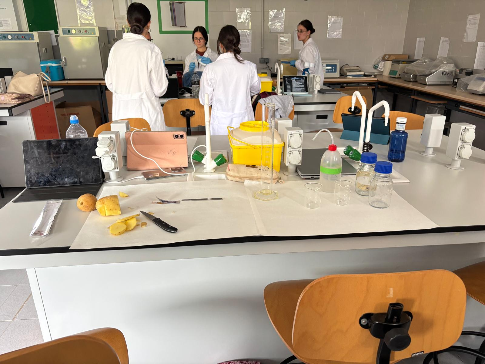
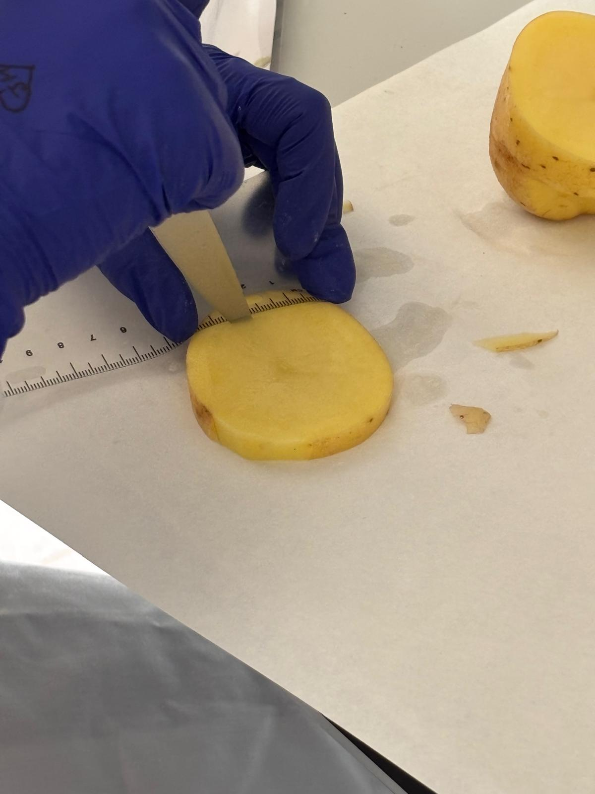
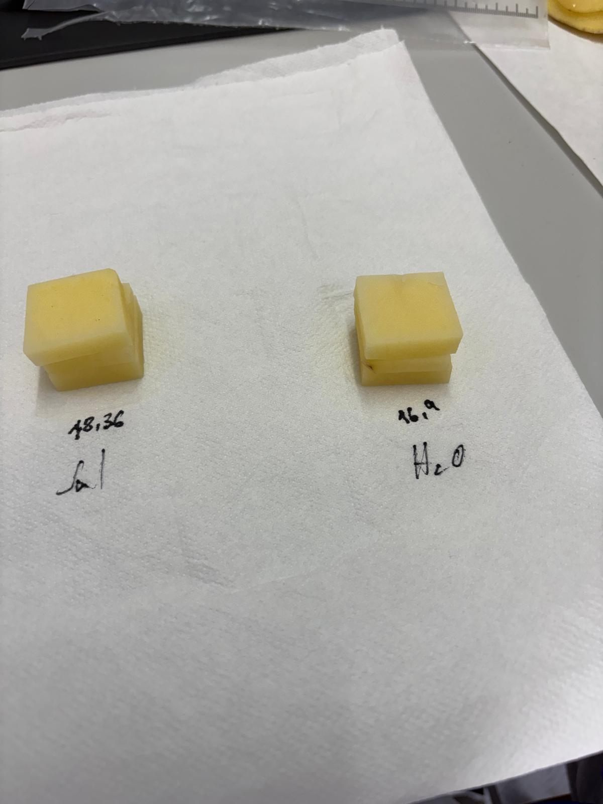
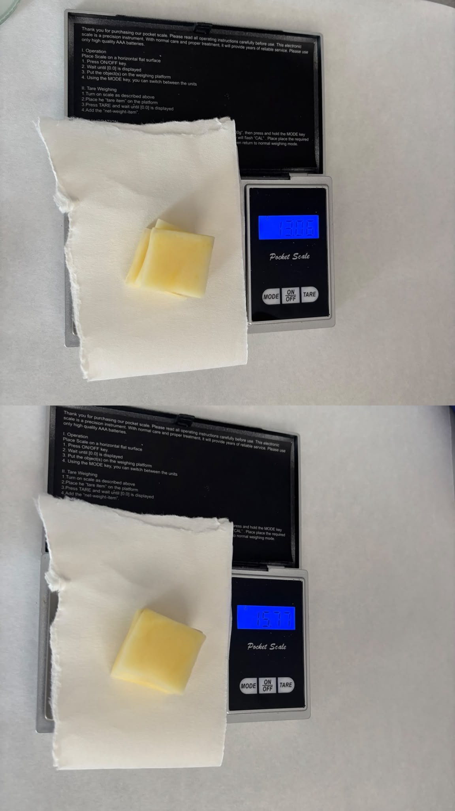
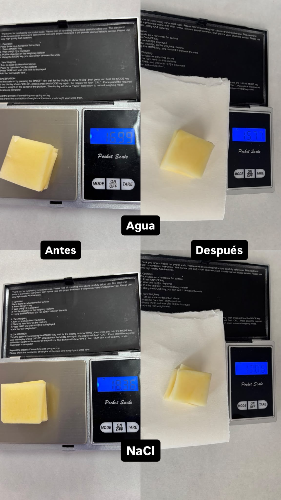

# P01 — Ósmosis en patata: modelo de tonicidad

> **Estado de esta página:** Completa individualmente los bloques **[ALUMNADO · RELLENABLE]**. La modalidad inicial es **SIMULATION_DEFAULT** según el programa canónico. Una demostración, imagen o conjunto de datos no acredita una ejecución real.

## 1. Identificación de la práctica

| Campo | Información |
|---|---|
| Código y título | `P01 — Ósmosis en patata: modelo de tonicidad` |
| Unidad didáctica | `UD3` |
| Resultado(s) de aprendizaje | `RA03` |
| Criterios de evaluación | `CE03.c` |
| Agrupamiento | Trabajo guiado; interpretación, registro y reflexión individuales. |
| Modalidad prevista | Modelo didáctico no hematológico; puede sustituirse por datos o imágenes. |
| Estado de ejecución | **SIMULATION_DEFAULT**; no equivale a autorización del centro. |

## 2. Resumen

Plantear una hipótesis y comparar el cambio de masa de tejido de patata en dos medios de distinta tonicidad. La ósmosis es el movimiento neto de agua a través de una barrera selectivamente permeable: el agua destilada actúa como medio hipotónico y la disolución de NaCl al 5 % como medio hipertónico respecto al tejido, en este modelo. Registrarás observaciones y cálculos como reales, simulados o documentales según corresponda.

## 3. Finalidad y resultados esperados

Observar un modelo vegetal de ósmosis y relacionar la tonicidad de dos medios con el cambio de masa de la patata. El agua destilada es el medio hipotónico y la disolución de NaCl al 5 % (m/v) es el medio hipertónico de esta comparación; la respuesta depende del tejido empleado y no permite inferir resultados hematológicos.

Al finalizar deberás poder:

- explicar el fundamento de la actividad;
- seguir el flujo de trabajo permitido para la modalidad asignada;
- registrar observaciones y evidencias con trazabilidad;
- distinguir datos observados, simulados e inferencias; y
- comunicar una conclusión proporcionada a la evidencia.

## 4. Recursos, seguridad y autorización

**Recursos previstos:** Modelo didáctico no hematológico; puede sustituirse por datos o imágenes. El equipo, los reactivos, los materiales y su disponibilidad deben confirmarse antes de la sesión.

**Riesgos y límites:** Material vegetal y disoluciones de aula. Confirma los reactivos disponibles, evita ingerirlos y limpia los derrames según las normas del centro. No atribuyas al modelo un resultado hematológico.

> **Aviso de seguridad.** La ficha conserva el estado **SIMULATION_DEFAULT** del programa. La aprobación de diseño no autoriza por sí misma la ejecución. Si faltan PNT, evaluación de riesgos, recursos, supervisión o autorización local, utiliza exclusivamente la modalidad alternativa indicada por el profesorado.

## 5. Fundamento técnico

La ósmosis es el movimiento neto de agua a través de una membrana selectivamente permeable en respuesta a diferencias de potencial hídrico. Un medio hipotónico tiene menor concentración efectiva de solutos que el interior celular y un medio hipertónico, mayor; el agua destilada y la disolución de NaCl al 5 % se emplean aquí como modelos, respectivamente. La pared celular y la composición del tejido vegetal hacen que esta observación no equivalga a la respuesta de un eritrocito. Para los conceptos se consultan [Universidad de La Rioja, Observación de la ósmosis en un huevo](https://multimedia.unirioja.es/video/68766a360e6f7743a4054330) y [Olimpiada Española de Biología, práctica sobre intercambios hídricos en tejido vegetal (PDF)](https://olimpiadadebiologia.edu.es/wp-content/uploads/2014/04/Practica_Osmosis_Valencia_2010_11328b2363506756cb3847ee133cfcd5.pdf); sus modelos y tejidos no son idénticos al de esta práctica.

Las fuentes enlazadas apoyan el fundamento o el control de calidad indicado; no sustituyen el PNT del centro ni autorizan parámetros que no documenten. Si no existe un procedimiento público aplicable al producto/equipo concreto, se indica expresamente y se reserva la ejecución para una validación local.

## 6. Procedimiento y controles de calidad

### Procedimiento base

Prepara una disolución de NaCl al 5 % (m/v) → compara porciones equivalentes de patata en esa disolución y en agua destilada → registra masas iniciales y finales tras 24 h → calcula la variación porcentual → interpreta el modelo y sus límites.

### Procedimiento específico

Esta actividad es un modelo vegetal no clínico. El procedimiento académico de referencia es [UT Southwestern Medical Center, Osmosis Demonstration Lab (PDF)](https://www.utsouthwestern.edu/media/other-activities/251270osmodemo.pdf), que describe cilindros de patata, tres por recipiente y 24 h de inmersión; aquí se adapta la geometría a porciones prismáticas rectangulares de 3 × 3 × 0,8 cm. Como contexto docente español, la [Olimpiada Española de Biología (PDF)](https://olimpiadadebiologia.edu.es/wp-content/uploads/2014/04/Practica_Osmosis_Valencia_2010_11328b2363506756cb3847ee133cfcd5.pdf) emplea NaCl y agua destilada con tejido vegetal distinto. Esta adaptación de dos medios, geometría y NaCl al 5 % es un protocolo didáctico, no un método analítico validado.

**Material e instrumental:** patata cruda; NaCl; agua destilada; balanza; probeta de 100 mL; dos vasos de precipitados o recipientes transparentes con tapa (capacidad mínima 150 mL); bisturí o cuchilla similar; tabla de corte; regla; pinzas; papel absorbente; etiquetas y rotulador. Usa el bisturí o la cuchilla únicamente bajo supervisión docente y con la protección indicada por el centro.

1. Ponte la protección indicada por el centro y reúne patata, NaCl, agua destilada, balanza, probeta, dos recipientes, bisturí o cuchilla similar, tabla de corte, regla, pinzas, etiquetas y papel absorbente.
2. Calcula 5 g de NaCl para 100 mL de disolución al 5 % (m/v). Pesa la sal en una balanza y registra la masa utilizada.
3. Disuelve la sal en unos 80 mL de agua destilada; tras disolverla, completa con agua destilada hasta un volumen final de 100 mL y mezcla.
4. Rotula un recipiente «NaCl 5 % — hipertónico» y el otro «agua destilada — hipotónico». Mide 100 mL de cada medio y viértelos en su recipiente correspondiente.
5. Lava y seca la patata. Con bisturí o cuchilla y regla, corta seis porciones sin piel en forma de prisma rectangular, cada una de 3 × 3 × 0,8 cm.
6. Forma dos grupos de tres porciones de dimensiones equivalentes. Sécalas con el mismo número de contactos de papel, sin apretar, y pesa cada grupo junto; registra la masa inicial de cada condición.
7. Introduce un grupo completo en cada recipiente con pinzas. Comprueba que las tres porciones de cada recipiente quedan cubiertas por su medio; coloca las tapas y registra la hora de inicio.
8. Mantén ambos recipientes durante 24 h en el mismo lugar, a temperatura ambiente y sin exposición directa al sol. Registra la hora de retirada; no intercambies ni añadas medios.
9. Retira las porciones de cada recipiente con pinzas, mantén separados los grupos y sécalas superficialmente con el mismo criterio aplicado al inicio.
10. Pesa juntas las tres porciones de cada condición en la misma balanza; registra las masas finales y cualquier pérdida de muestra o desviación.
11. Calcula para cada condición: variación porcentual = [(masa final − masa inicial) / masa inicial] × 100. Conserva unidades, signo y cifras significativas.
12. Compara los cambios de masa y las observaciones de aspecto; indica si concuerdan con la hipótesis y limita la conclusión a este modelo vegetal.
13. Desecha los restos vegetales y las disoluciones según las indicaciones docentes; limpia y seca el material reutilizable y registra incidencias.

### Controles de calidad

- Porciones del mismo origen y dimensiones (3 × 3 × 0,8 cm); volumen final de medio y tiempo de inmersión iguales entre condiciones; identificación inequívoca; mismo criterio de secado y pesada; unidades y fórmula visibles; conclusión limitada al modelo.
- La fuente y la modalidad de cada imagen, registro o dato quedan identificadas.
- Los datos simulados no se presentan como resultados de paciente ni como ejecución del alumnado.
- Las incidencias, resultados no válidos y limitaciones se conservan en el registro.

### Referencia técnica

- [Universidad de La Rioja, Observación de la ósmosis en un huevo](https://multimedia.unirioja.es/video/68766a360e6f7743a4054330) (consultado el 29/09/2026). Apoya la explicación de medios hipotónicos e hipertónicos mediante un modelo didáctico distinto.
- [Olimpiada Española de Biología, práctica sobre intercambios hídricos en tejido vegetal (PDF)](https://olimpiadadebiologia.edu.es/wp-content/uploads/2014/04/Practica_Osmosis_Valencia_2010_11328b2363506756cb3847ee133cfcd5.pdf) (consultado el 29/09/2026). Referencia de contexto para el uso de NaCl y agua destilada en una práctica vegetal; emplea otro tejido y no prescribe este protocolo de patata.
- [UT Southwestern Medical Center, Osmosis Demonstration Lab (PDF)](https://www.utsouthwestern.edu/media/other-activities/251270osmodemo.pdf) (consultado el 29/09/2026). Referencia docente para el número de réplicas por recipiente y el periodo de 24 h; su geometría cilíndrica se sustituye aquí por porciones prismáticas de 3 × 3 × 0,8 cm. Esta adaptación no constituye PNT local.

Fecha de consulta de las referencias enlazadas: **29/09/2026**.

Cuando no se enlaza un PNT operativo local, estos documentos públicos aportan contexto o control de calidad, no una receta lista para ejecutar. El docente debe confirmar el PNT específico antes de autorizar un procedimiento real.

# Tu cuaderno de prácticas

## 7. Datos de realización [ALUMNADO · RELLENABLE · DURANTE]

- **Nombre y apellidos:** [Escribe tu nombre y apellidos]
- **Fecha real de realización:** [dd/mm/aaaa]
- **Grupo:** [Indica tu grupo]
- **Pareja de trabajo, si procede:** [Indica el nombre o «Trabajo individual»]
- **Rol o tarea principal:** [Describe tu participación]
- **Modalidad realmente realizada:** [Real autorizada / demostración / simulada / documental; describe]
- **Código o descripción del material/dataset:** [Completa sin incluir datos personales o clínicos]

## 8. Preparación y análisis inicial [ALUMNADO · RELLENABLE · DURANTE]

### 8.1 Verificación previa

| Comprobación | Registro |
|---|---|
| Autorización o modalidad asignada | [Completa] |
| PNT, fuente o material docente consultado | [Completa; indica versión si consta] |
| Equipo/material realmente utilizado | [Completa o «No aplica»] |
| Medidas de seguridad aplicadas | [Completa o «No aplica»] |
| Condición de los datos (real/simulada/documental) | [Completa] |

### 8.2 Hipótesis u observación inicial

Indica qué esperas observar o resolver. Si trabajas con datos simulados o documentos, formula la expectativa con la información proporcionada.

[Escribe aquí tu hipótesis u observación inicial.]

## 9. Observaciones, controles y resultados [ALUMNADO · RELLENABLE · DURANTE]

### 9.1 Comprobación de calidad

| Control o criterio | Evidencia observada o realizada | ¿Adecuado? | Justificación |
|---|---|---|---|
| Identificación y procedencia | Identifique las muestras de patatas y las soluciones que utilice. Comprobé que cada muestra estaba bien identificada.| Sí | Comprobé que cada muestra estuviera correctamente identificada.|
| Material, imagen o datos legibles | Registré las masas iniciales y finales y anoté mis observaciones.| [Sí | Pude leer y comparar correctamente los datos.|
| Gestión de residuos generados | Recogí los restos de patatas y las soluciones al terminar la práctica.| Sí | Y recogí los residuos adecuadamente y dejé limpio los materiales. |

### 9.2 Registro de observaciones o cálculos

| Observación, variable o cálculo | Dato/evidencia | Comentario |
|---|---|---|
| [Registro 1] | Cambio de masa de agua. | Observe que la patata disminuyó de tamaño. Las células se pueden haber muerto y se produce una lisis celular debido al tiempo de exposición entonces la membrana deja de funcionar|
| [Registro 2] | Cambio de masa en disolución salina| Observé que la patata perdió masa. Comprobé que el agua salió de las células hacia la disolución más concentrada.|
| [Registro 3] | Relación entre concentración y masa.|Observé que el aumentar la concentración de sal disminuyó más masa de la patata. Comprobé que la concentración de la disolución influye en el movimiento del agua por ósmosis. |

### 9.3 Resultado principal
Resume el resultado y especifica qué procede de observación real, demostración, imagen, dato simulado o análisis documental.

[Observé que la patata perdió masa tanto en el agua como en la disolución salina. En el agua, la pérdida de masa pudo deberse al daño o rotura de algunas células, mientras que en la disolución salina el agua salió de las células por ósmosis. Con esta práctica comprobé que la concentración del medio influye en el movimiento del agua a través de las células de la patata. El resultado procede de mis observaciones y de los datos obtenidos durante la práctica.]

## 10. Evidencias visuales [ALUMNADO · RELLENABLE · DURANTE Y DESPUÉS]

Añade entre **5 y 8 evidencias visuales** que cubran la preparación, las fases principales del procedimiento y el resultado final. Incorpora solo imágenes cuya captura y publicación estén autorizadas. Identifica si cada evidencia es propia, de demostración, simulada o documental; no atribuyas al alumnado imágenes que no haya generado.

### Imagen 1 — Preparación de los medios

- **Archivo previsto:** `../assets/P01/P01_01_preparacion_medios.jpg`
- **Texto alternativo:** Preparación y rotulado del agua destilada y de la disolución de NaCl al 5 %.
- **Pie de foto:** Preparación de 100 mL de disolución de NaCl al 5 % (m/v) y rotulado de ambos medios: agua destilada (hipotónico) y NaCl (hipertónico).
- **Imagen del alumnado:** [Añade la imagen autorizada o escribe «No aplica» y explica.]

*Figura 1. Medios preparados y rotulados antes de iniciar la comparación.*

### Imagen 2 — Corte de las porciones de patata

- **Archivo previsto:** `../assets/P01/P01_02_corte_porciones.jpg`
- **Texto alternativo:** Corte supervisado de porciones prismáticas de patata de 3 × 3 × 0,8 cm.
- **Pie de foto:** Corte con bisturí o cuchilla y regla de seis porciones de patata sin piel, con dimensiones aproximadas de 3 × 3 × 0,8 cm.
- **Imagen del alumnado:** [Añade la imagen autorizada o escribe «No aplica» y explica.]

*Figura 2. Porciones prismáticas cortadas y listas para agruparse por condición.*

### Imagen 3 — Pesada inicial e inmersión

- **Archivo previsto:** `../assets/P01/P01_03_pesada_inmersion.jpg`
- **Texto alternativo:** Pesada inicial de los grupos de patata e inmersión separada en cada medio.
- **Pie de foto:** Registro de la masa inicial de cada grupo y colocación de tres porciones en cada recipiente, cubiertas por el medio correspondiente.
- **Imagen del alumnado:** [Añade la imagen autorizada o escribe «No aplica» y explica.]

*Figura 3. Grupos identificados al inicio de la inmersión en agua destilada y NaCl al 5 %.*

### Imagen 4 — Retirada y pesada final

- **Archivo previsto:** `../assets/P01/P01_04_retirada_pesada_final.jpg`
- **Texto alternativo:** Porciones retiradas tras 24 horas, secadas superficialmente y pesadas por condición.
- **Pie de foto:** Tras 24 h, los grupos se retiran por separado, se secan con el mismo criterio y se registra la masa final de cada condición.
- **Imagen del alumnado:** [Añade la imagen autorizada o escribe «No aplica» y explica.]

*Figura 4. Pesada final de los grupos, manteniendo separados los dos medios.*

### Imagen 5 — Comparación de resultados

- **Archivo previsto:** `../assets/P01/P01_05_comparacion_resultados.jpg`
- **Texto alternativo:** Comparación final de las porciones y de las masas iniciales y finales en ambos medios.
- **Pie de foto:** Comparación de los grupos tras la inmersión y de sus masas iniciales y finales; anota el cambio observado sin extrapolarlo fuera del modelo vegetal.
- **Imagen del alumnado:** [Añade la imagen autorizada o escribe «No aplica» y explica.]

*Figura 5. Resultado final de ambas condiciones y evidencia usada para la comparación.*

Puedes añadir hasta tres evidencias más si documentan otros pasos relevantes; conserva la secuencia y la misma convención de nombres.

## 11. Incidencias, errores y medidas correctoras [ALUMNADO · RELLENABLE · DURANTE]

| Incidencia, error o duda | Posible causa | Medida aplicada o propuesta | ¿Afectó al resultado? |
|---|---|---|---|
| En el medio hipotónico la patata ha disminuido su peso | Ha ocurrido una lisis celular debido al tiempo de exposición y la membrana ha dejado de funcionar| Disminuir el tiempo de exposición| Sí |

## 12. Interpretación técnica [ALUMNADO · RELLENABLE · DESPUÉS]

Interpreta el cambio de masa observado en patata mediante la ósmosis y la tonicidad de los medios hipotónico e hipertónico. Explica qué patrón respaldan los datos, usa los controles y evidencias, y reconoce que el tejido vegetal es solo un modelo conceptual. Separa observación, cálculo, hipótesis e información no disponible; no excedas el alcance didáctico ni formules un diagnóstico individual.

[Escribe aquí tu interpretación técnica.]

## 13. Conclusión [ALUMNADO · RELLENABLE · DESPUÉS]

Indica si alcanzaste el objetivo, qué evidencia sostiene la conclusión y qué limitaciones tuvo la modalidad realmente realizada.

[Escribe aquí tu conclusión.]

## 14. Reflexión profesional [ALUMNADO · RELLENABLE · DESPUÉS]

Responde individualmente y relaciona cada respuesta con datos, observaciones o imágenes de esta ficha.

**1. Procedimiento:** ¿Qué parte del procedimiento te ha resultado más compleja y cómo lo solucionaste o afrontaste?

   [Respuesta del alumnado]

**2. Interpretación:** ¿Qué ha ocurrido en la patata tras 24 horas en las diferentes soluciones? ¿Por qué?

   [Respuesta del alumnado]

**3. Conclusiones:** Relaciona los fenómenos osmóticos con el resultado de tu práctica.

   [Respuesta del alumnado]

**4. Aprendizaje y transferencia:** ¿Qué técnica hematológica se basa en el mismo principio? Justifica o explica tu respuesta.

   [Respuesta del alumnado]

## 15. Trazabilidad y entrega [ALUMNADO · RELLENABLE · DESPUÉS]

| Campo | Registro del alumnado |
|---|---|
| Identificador de práctica | `P01` |
| Fecha | [dd/mm/aaaa] |
| UD / RA / CE | `UD3 / RA03 / CE03.c` |
| Agrupamiento | [Individual / pareja; especifica] |
| Modalidad y origen de evidencia | [Completa] |
| Materiales, equipo o fuente usados | [Completa o «No aplica»] |
| Controles | [Resume o enlaza al apartado 9.1] |
| Resultado | [Resume o enlaza al apartado 9.3] |
| Interpretación | [Resume o enlaza al apartado 12] |
| Incidencias y acciones | [Resume o enlaza al apartado 11] |
| Ruta de residuos | [Completa o «No aplica»] |
| Estado de entrega | [Borrador / pendiente de revisión / entregado / corregido] |
